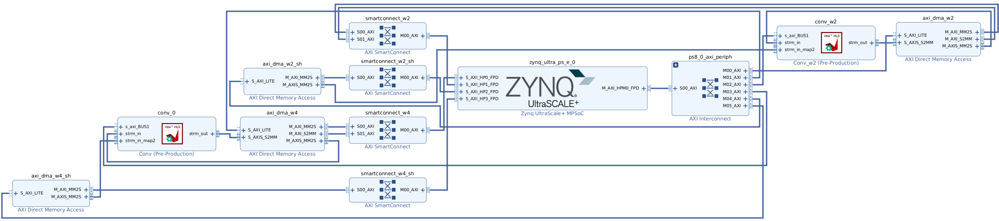

# FPGA Design of Mixed-Precision CNNs (ResNet)

**Figure:** *Block diagram of the hardware architecture of the ResNet18 HW/SW implementation*

This repository was used to produce the results present in my Master's Dissertation:

> **FPGA Design of Mixed-Precision Convolutional Neural Networks**  
> Pedro Ferreira  
> Abstract:
> 
> The objective of this work is to develop a mixed-precision convolutional neural network (CNN) using a System-On-Chip (SoC) FPGA. The developed system aims to benefit from low precision while maintaining a balance between image classification accuracy and inference time.

> Image classification is a critical task in computer vision applications. State-of-the-art models using convolutional neural networks require high accuracy but have demanding computational costs. Applications that require edge computing cannot afford high-energy solutions, emphasizing the need for efficient high-performance solutions.

> A dedicated hardware/software system was designed to implement a specific ResNet18 model with mixed-precision in a Zynq Ultrascale+ SoC FPGA. The CNN model was trained and evaluated with different mixed-precision configurations and a solution was selected for implementation that uses convolution layers with 8-bit activations and weights with 4 bit-width and 2 bit-width. Two dedicated convolution hardware accelerators were designed, one for each quantization configuration, both of which are capable of computing 256 MACs per clock cycle.

> In the final hardware/software system, all the convolutional layers (more than 99% of the total operations) are executed in the hardware IPs and the two non-convolutional layers (less than 1% of the total operations) are executed in software in the ARM processor of the SoC-FPGA.

> The system achieves a frame rate of 32 FPS, with a performance per watt 4.5x higher than a NVIDIA GeForce RTX 3080 Ti GPU. 
